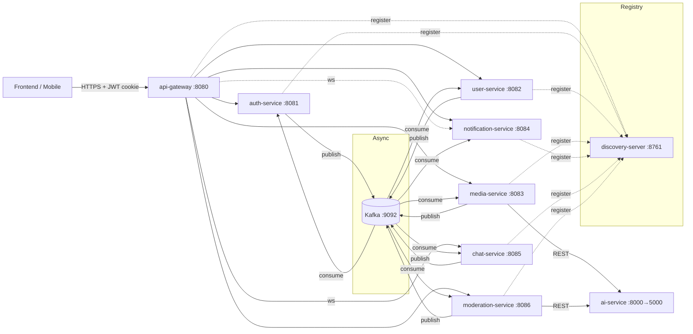

# 01 · Kiến trúc tổng quan

> Mục tiêu tài liệu: đọc xong là hiểu hệ thống có gì, chạy ở đâu, nói chuyện với nhau thế nào — **không cần mở code**. Chi tiết từng service nằm ở `docs/services/`.

## 1. Bức tranh lớn

Backend mạng xã hội theo kiến trúc microservices: **1 API gateway + 1 service registry + 6 business service (Spring Boot 4.0.3, Java 21) + 1 AI service (Python/FastAPI)**, giao tiếp đồng bộ qua REST (Spring HTTP Interface + RestClient, load-balance qua Eureka) và bất đồng bộ qua **Kafka**. Mỗi service có **database riêng** (database-per-service), không service nào đọc bảng của service khác.

## 2. Danh sách service

| Module | Port | Vai trò | Datastore | Phụ thuộc đồng bộ (REST) |
|---|---|---|---|---|
| `discovery-server` | 8761 | Eureka registry | – | – |
| `api-gateway` | 8080 | Cửa vào duy nhất: route theo prefix, CORS, chặn `/internal/**`, gom Swagger | – | tất cả (proxy) |
| `common` | – | Thư viện dùng chung (contracts, security, exception, JPA base) | – | – |
| `auth-service` | 8081 | Credential, RBAC (role/permission), phát JWT + refresh token, OTP email | Postgres `auth_db` | user-service (tạo profile staff) |
| `user-service` | 8082 | Profile, follow, bạn bè, gợi ý bạn (Neo4j), admin user view | Postgres `user_db`, Neo4j | auth-service (credential batch) |
| `media-service` | 8083 | Post, comment, react, upload MinIO, feed gợi ý (Milvus + Neo4j), cache Redis | Postgres `media_db`, Redis, Neo4j (chung instance với user), MinIO, Milvus | user-service, ai-service |
| `notification-service` | 8084 | Nhận event → lưu thông báo → push STOMP | Postgres `notification_db` | user-service (khi cache actor thiếu) |
| `chat-service` | 8085 | Phòng chat (Postgres), tin nhắn (MongoDB), STOMP realtime | Postgres `chat_db`, MongoDB, Redis (cache profile) | user-service |
| `moderation-service` | 8086 | Report, complaint, moderation log, AI kiểm duyệt, API tổng hợp cho admin | Postgres `moderation_db` | auth, user, media, chat, ai-service |
| `ai-service` | 8000 (host) / 5000 (container) | Embedding tiếng Việt (PhoBERT SimCSE), phân loại toxic (ViSoBERT), NSFW/vũ khí (ViT) | – (model HuggingFace) | MinIO (tải media) |

Tất cả service Java đều **stateless**, xác thực JWT tại chính service (gateway không giữ session, không validate token — xem `03-bao-mat.md`).

## 3. Luồng request tiêu biểu

1. Client gọi `POST /api/v1/auth/login` qua gateway → auth-service kiểm tra mật khẩu, trả JSON + set cookie `jwt` (HS256, claims `userId`, `roles`) và cookie `refreshToken`.
2. Mọi request sau mang cookie `jwt` (hoặc header `Authorization: Bearer`). Gateway route theo prefix (`/api/v1/users/**` → `lb://user-service`, …). Service đích chạy `JwtAuthenticationFilter` (từ `common`) → principal = `userId`, authorities = claim `roles`.
3. Service gọi service khác qua Spring HTTP Interface trên `RestClient` `@LoadBalanced` (Eureka), luôn tới endpoint `/internal/**` với header `X-Internal-Token`.
4. Side effect liên service đi qua Kafka (xem `04-kafka-events.md`); event chỉ được publish **sau khi transaction DB commit**.

## 4. Luồng nghiệp vụ chính (tóm tắt)

| Luồng | Các bước |
|---|---|
| Đăng ký (saga choreography) | auth lưu credential `WAITING` → `UserCreatedEvent` → user-service tạo profile → `ProfileCreatedEvent` (auth chuyển `PENDING`) hoặc `ProfileFailedEvent` (auth chuyển `NOT_SOLVED`). media/notification cũng nghe `UserCreatedEvent` để tạo `user_caches`. |
| Xác minh email | `sendVerifyEmail` → OTP 6 số qua SMTP → `verify-otp` → `ACTIVE`. Chỉ tài khoản `ACTIVE` mới login được. |
| Kết bạn | user-service lưu `PENDING` → `NotificationEvent(FRIEND_REQUEST)`; accept → `FRIEND` + follow 2 chiều + `FriendAcceptedEvent` (chat tạo phòng riêng, Neo4j thêm cạnh) + `NotificationEvent(FRIEND_ACCEPT)`. Unfriend/block → `FriendshipDeletedEvent`. |
| Đăng bài | media upload MinIO → lưu post → `ContentCreatedEvent` → (a) moderation gọi AI, nếu toxic publish `ModerationActionEvent(BLOCK)` → media ẩn bài; (b) media tự index Milvus + Neo4j để gợi ý. |
| Nhắn tin | chat kiểm tra membership → lưu Mongo → push STOMP `/queue/conversation/{roomId}` → `MessageCreatedEvent` (moderation quét text) + `MessageNotificationEvent` (notification tạo thông báo MESSAGE). |
| Kiểm duyệt thủ công | admin gọi moderation → `ModerationActionEvent(BLOCK/UNBLOCK)` cho POST/COMMENT (media) hoặc MESSAGE (chat); khoá user → `UserModerationEvent` → auth đổi `AccountStatus`, thu hồi refresh token. |
| Feed gợi ý | media: embed query (ai-service) → Milvus top-K → điểm xã hội Neo4j → lọc theo network (user-service `network-ids`) + access scope → trang kết quả; fallback feed theo thời gian khi AI/Milvus lỗi. |

## 5. Nguyên tắc kiến trúc đang áp dụng

- **Database-per-service**; chỉ Neo4j là instance dùng chung giữa user-service (node `UserNode`, cạnh `FRIENDS_WITH`) và media-service (node `Post`, cạnh `POSTED`) — chấp nhận vì cùng một đồ thị xã hội, ghi chú là nợ kỹ thuật.
- **Contract tập trung trong `common`**: event record, enum, DTO liên service, topic name, path constant. Không service nào định nghĩa bản sao riêng.
- **Read model / cache cục bộ** thay cho join liên service: `user_caches` ở media & notification, cập nhật bằng `UserCreatedEvent` + `ProfileUpdatedEvent`.
- **Internal API tách khỏi public API**: mọi endpoint service-to-service nằm dưới `/api/v1/<svc>/internal/**`, gateway trả 404, service yêu cầu `X-Internal-Token`.
- **Fail closed** cho kiểm duyệt: AI lỗi → Kafka retry/DLT, không bao giờ coi là "sạch".
- **Idempotency** cho consumer ghi DB (`eventId` của `NotificationEvent`, kiểm tra tồn tại trong saga handler).

## 6. Hạn chế đã biết (cần nhớ khi mở rộng)

- STOMP dùng **simple broker in-memory** ở chat & notification → chỉ chạy đúng với 1 instance mỗi service. Muốn scale cần broker relay (RabbitMQ) hoặc fan-out qua Redis/Kafka.
- Chưa có outbox pattern; publish-after-commit giảm nhưng không loại bỏ hoàn toàn mất event khi Kafka down đúng lúc.
- Eureka và ai-service không có xác thực; chỉ dùng trong mạng nội bộ/docker network.
- `ddl-auto: update` ở dev; prod dùng `validate` — chưa có Flyway/Liquibase.
